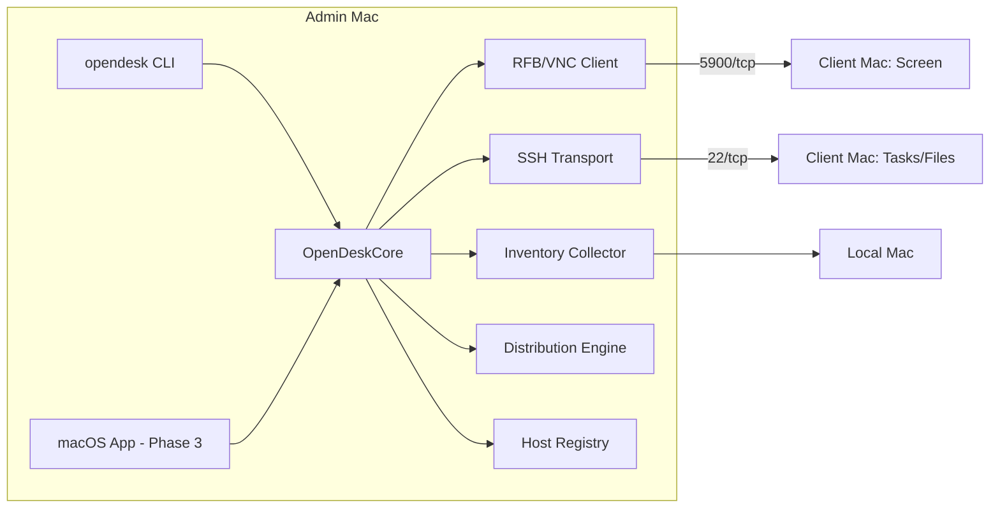

# OpenDesk-Admin Architecture

## 1. System Overview



## 2. Modules

| Module | Responsibility | Key types |
|---|---|---|
| `OpenDeskCore/Protocol` | RFB (VNC) handshake, security, pixel format, framebuffer updates | `RFBClient`, `PixelFormat`, `Framebuffer` |
| `OpenDeskCore/Transport` | Host registry, SSH command execution, file push | `Host`, `HostRegistry`, `SSHTransport` |
| `OpenDeskCore/Control` | Screen session orchestration (observe/control modes) | `ScreenSession` |
| `OpenDeskCore/Inventory` | Hardware/software report collection | `InventoryCollector`, `MachineReport` |
| `OpenDeskCore/Tasks` | Task definitions, execution, result capture | `TaskDefinition`, `TaskEngine`, `TaskResult` |
| `OpenDeskCore/Distribution` | File copy + package install | `DistributionEngine` |
| `OpenDeskCLI` | Command-line admin interface | `opendesk` executable |

## 3. Data Model

```json
// Host (HostRegistry entry, stored as JSON at ~/.opendesk/hosts.json)
{
  "id": "UUID",
  "hostname": "lab-imac-01.local",
  "port": 22,
  "username": "admin",
  "authMethod": "key|password",
  "groups": ["lab-2", "staff"],
  "screenPort": 5900,
  "lastSeen": "2026-09-13T00:00:00Z"
}

// TaskDefinition (saved task, ~/.opendesk/tasks/*.json)
{
  "id": "UUID",
  "name": "collect-sw-vers",
  "command": "sw_vers",
  "timeoutSeconds": 30,
  "targetGroups": ["lab-2"],
  "version": 1
}

// TaskResult
{
  "taskId": "UUID",
  "host": "lab-imac-01.local",
  "exitCode": 0,
  "stdout": "...",
  "stderr": "...",
  "durationMs": 412,
  "startedAt": "..."
}
```

## 4. Key Design Decisions

| Decision | Choice | Rationale |
|---|---|---|
| Task/file channel | SSH (Foundation Process / NSSharedFileOperations via ssh+rsync) | Standard, auditable, WAN-friendly, no client agent needed |
| Screen channel | RFB 003.008 with VNC auth + Apple auth where available | Open standard; macOS has built-in VNC server (enable in System Settings) |
| Inventory | `system_profiler -json` + filesystem scan | Supported API on all modern macOS versions incl. Apple Silicon |
| Package install | `installer -pkg` over SSH | First-party supported path |
| Persistence | JSON files in `~/.opendesk/` | Zero-dependency MVP; Postgres/Supabase deferred until multi-admin needs emerge |
| Language | Swift 6, no external dependencies for MVP | Reproducible builds, native macOS |

## 5. Failure Modes & Handling

| Failure | Detection | Handling |
|---|---|---|
| Host unreachable | SSH connect timeout | `TaskResult(exitCode: -1, error: .hostUnreachable)`; fleet run continues to other hosts |
| Auth failure | SSH auth error | Surface per-host; never retry with same credentials in a loop |
| VNC handshake mismatch | Protocol version reply | Fall back through 3.8 → 3.3; fail with clear message |
| Package install fails | `installer` non-zero exit | Capture installer stderr into TaskResult |
| Partial fleet task | Aggregated results | CLI prints per-host table; non-zero exit if any host failed |

## 6. Testing Strategy

- Unit tests for RFB handshake state machine (mock socket), task result aggregation, host registry CRUD.
- Integration test for local inventory collection (runs `system_profiler` on the test machine).
- CLI smoke tests via `swift run opendesk --help` and `inventory --local`.
