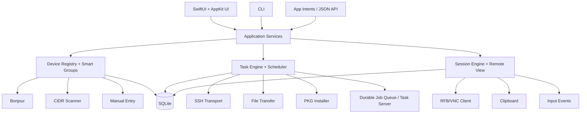
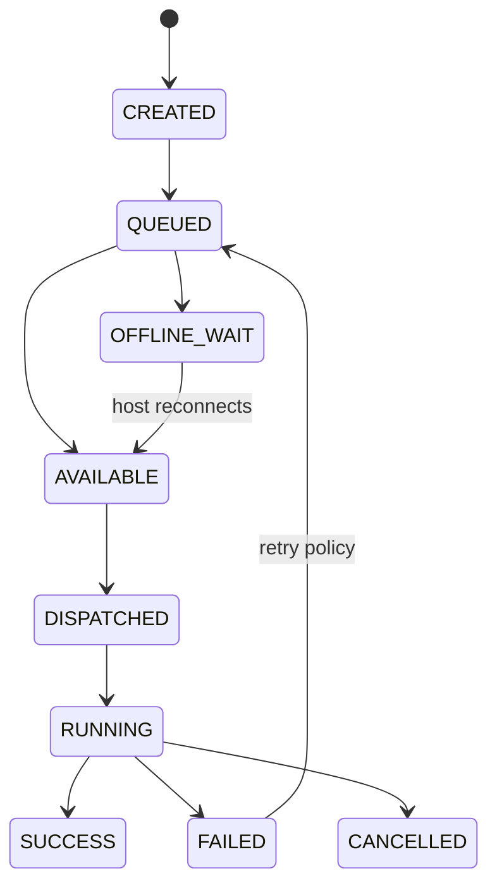

# OpenDesk Admin — Architecture

## 1. System Overview



## 2. Core Design Decisions

| # | Decision | Rationale |
|---|---|---|
| 1 | **V1 exploits built-in macOS capabilities** — ARDAgent (`/System/Library/CoreServices/RemoteManagement/ARDAgent.app`) + SSH | Massively reduces scope; no privileged agent needed everywhere |
| 2 | **Every operation is a Task** | One generic task object powers commands, transfers, installs, inventory, schedules |
| 3 | **API-first internally** | UI, CLI, Shortcuts, and JSON API all call the same application services |
| 4 | **SQLite from day one** | Matches ARD's own approach (`/private/var/db/RemoteManagement/RMDB/`); zero cloud dependency |
| 5 | **Keychain for secrets** | SQLite stores `credential_reference` UUIDs only |
| 6 | **RFB/VNC for remote control** | Immediate macOS + Linux + Windows interoperability |
| 7 | **SSH as management backbone** | Commands, scripts, SFTP transfers, `installer` package deployment |
| 8 | **Functional compatibility first, wire compatibility second** | ~90–95% parity without proprietary protocol reconstruction |

## 3. Module Boundaries

| Module | Responsibility | Depends on |
|---|---|---|
| `core` | Shared types: Device, Task, Result, errors, config | — |
| `device-registry` | Devices, groups, smart groups (predicates), persistence | core |
| `discovery` | Bonjour, CIDR scan, manual entry → registry | core, device-registry |
| `rfb` | RFB/VNC client: framebuffer, input, clipboard, reconnect | core, protocol |
| `ssh` | Command/script execution, SFTP transport | core |
| `transfers` | Push/pull, resume, checksums, progress, bandwidth limits | ssh, core |
| `packages` | `.pkg` staging, checksum, `installer`, result capture, cleanup | transfers, ssh |
| `inventory` | Collectors: hardware, storage, network, OS, apps, users, files | ssh, core |
| `tasks` | Task object, queue, retries, idempotency, per-host results | core, device-registry |
| `scheduler` | Run now / once / RRULE repeat / on-reconnect / on-predicate | tasks |
| `reporting` | Report queries, exports, software comparison | inventory, tasks |
| `security` | Keychain credential store, RBAC, audit events | core |
| `protocol` | Wire-format primitives shared by rfb/ssh/transports | core |

**Rule:** no module imports SwiftUI. UI depends on services; services never depend on UI.

## 4. Task State Machine



Generic task object (see [DATA-MODEL.md](DATA-MODEL.md)):

```json
{
  "id": "task_uuid",
  "type": "install_package",
  "targets": ["mac_001", "mac_002"],
  "parameters": {},
  "execution": { "mode": "immediate" },
  "schedule": null,
  "status": "queued",
  "createdAt": "",
  "startedAt": null,
  "completedAt": null,
  "results": {}
}
```

## 5. Multi-Observe Architecture

```
Device 1..N ──► Thumbnail Renderer ──► SwiftUI Grid
```

Frame-rate throttling: focused 30–60 FPS · visible thumbnail 2–5 FPS · background 0.2–1 FPS.

## 6. Task Server (Worker)

Durable SQLite job queue + launchd daemon + device heartbeat. Handles offline targets: jobs wait, execute on reconnect, with retry policy, backoff, idempotency keys, deadlines, concurrency and bandwidth limits, per-host results.

## 7. High-Performance Streaming (V2+)

```
ScreenCaptureKit → VideoToolbox (H.264/HEVC) → QUIC/UDP transport
→ VideoToolbox decode → Metal renderer
```

Separate streams: video, audio, pointer, keyboard, clipboard, control, telemetry. Targets: 30/60 FPS, 4K, adaptive bitrate, HDR, multi-display, hardware encode/decode. **Not a v1 blocker.**

## 8. Client Strategy Phases

| Phase | Capability |
|---|---|
| V1 | Apple built-in Remote Management + SSH |
| V2 | Lightweight OpenDesk agent (inventory, messages, jobs, transfers, heartbeats) |
| V3 | Agent independent of ARDAgent (LaunchDaemon + per-user LaunchAgent, narrow authenticated IPC) |
| V4 | Fully open-source remote-management stack |

## 9. Automation Surfaces

1. CLI (`opendesk`)
2. App Intents / Shortcuts
3. JSON task API
4. Local REST / Unix socket API

All four call the same application services. Example agent-driven invocation:

```json
{
  "action": "execute",
  "targets": { "group": "Apple Silicon Lab" },
  "command": "softwareupdate -l"
}
```
