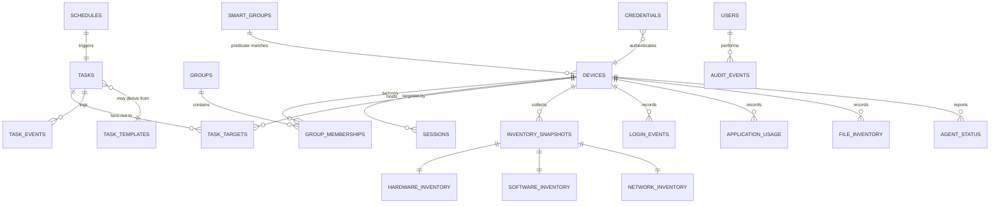
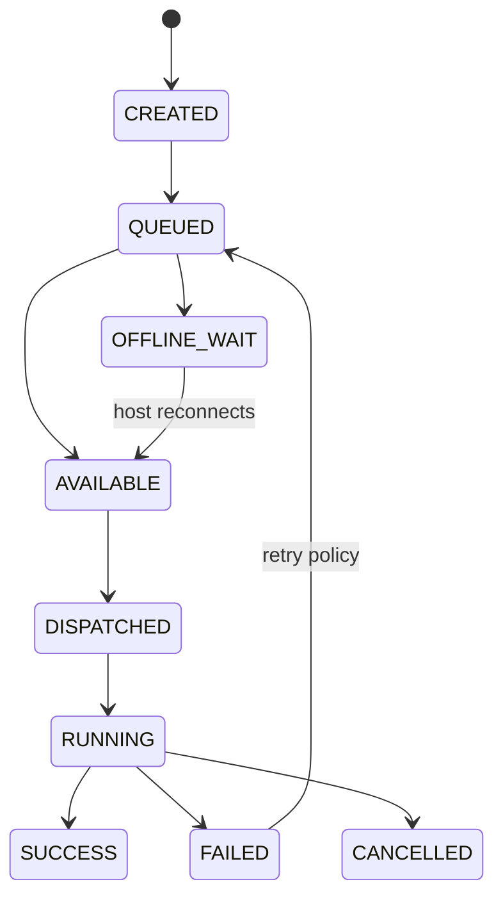

# Data Model

SQLite from day one. No cloud DB. Secrets never stored in SQLite — Keychain holds secrets; SQLite stores `credential_reference` UUIDs.

Reference schema: [`packages/device-registry/Assets/schema.sql`](../../packages/device-registry/Assets/schema.sql)

## 1. Entity Overview



## 2. Core Tables

| Table | Purpose | Key fields |
|---|---|---|
| `devices` | Registered Macs | id, hostname, ips, mac_address, os_version, architecture, ard_version, rfb_available, ssh_available, online, last_seen |
| `credentials` | Keychain references | id, device_id, kind (password/ssh_key/cert/agent_token/vnc), credential_reference (UUID), username |
| `groups` | Static lists | id, name, parent_id |
| `group_memberships` | Device↔group | group_id, device_id |
| `smart_groups` | Dynamic groups | id, name, predicate_json |
| `sessions` | Remote-control sessions | id, device_id, mode (observe/control), started_at, ended_at |
| `tasks` | Universal task object | id, type, parameters_json, execution_json, schedule_id, status, created_at, started_at, completed_at |
| `task_targets` | Per-host fan-out | task_id, device_id, status, result_json, error |
| `task_events` | Task lifecycle log | task_id, device_id, event, payload_json, at |
| `task_templates` | Reusable actions | id, name, type, parameters_json |
| `schedules` | Triggers | id, rrule, run_at, on_reconnect, predicate_json |
| `inventory_snapshots` | Collection runs | id, device_id, collected_at |
| `hardware_inventory` | HW facts | snapshot_id, architecture, memory_bytes, model, serial_ref |
| `software_inventory` | Installed apps | snapshot_id, bundle_id, name, version, path |
| `network_inventory` | NICs/routes | snapshot_id, interface, addresses, gateway |
| `users` | Console users | id, name, role |
| `login_events` | Login/logout history | device_id, username, kind, at |
| `application_usage` | App usage history | device_id, bundle_id, used_at, duration_s |
| `file_inventory` | File search results | device_id, path, size, modified_at |
| `audit_events` | Admin action log | id, user_id, action, target, payload_json, at |
| `agent_status` | Agent heartbeats | device_id, version, last_heartbeat, capabilities_json |

## 3. Universal Task Object

```json
{
  "id": "task_uuid",
  "type": "install_package",
  "targets": ["mac_001", "mac_002"],
  "parameters": {},
  "execution": { "mode": "immediate" },
  "schedule": null,
  "status": "queued",
  "createdAt": "",
  "startedAt": null,
  "completedAt": null,
  "results": {}
}
```

`type` ∈ `execute_command | run_script | copy_files | fetch_files | install_package | inventory_collect | wake | sleep | restart | shutdown | logout | lock_screen | send_message | file_search | software_compare`

`execution.mode` ∈ `immediate | on_reconnect | on_predicate`

`status` ∈ `created | queued | available | offline_wait | dispatched | running | success | failed | cancelled`

## 4. Task State Machine



## 5. Smart Group Predicates

Stored as JSON predicates, e.g.:

```json
{
  "op": "AND",
  "clauses": [
    { "field": "os_version", "op": "<", "value": "26" },
    { "field": "architecture", "op": "=", "value": "arm64" },
    { "field": "online", "op": "=", "value": true }
  ]
}
```

## 6. Scheduling

Recurrence via RRULE (RFC 5545), e.g. `FREQ=WEEKLY;BYDAY=FR;BYHOUR=22`. Every action supports: run now · run once later · repeat · run when host available · run when predicate true.

## 7. Secrets Model

```
SQLite:  credentials.credential_reference = UUID
Keychain: UUID → secret (password | SSH private key | certificate | agent token | VNC credential)
```

## 8. Inventory Snapshot Shape

```json
{
  "device": "mac-17",
  "collectedAt": "2026-09-13T18:00:00Z",
  "hardware": { "architecture": "arm64", "memoryBytes": 68719476736 },
  "os": {},
  "network": [],
  "storage": [],
  "applications": []
}
```

Collectors (independent, normalized into SQLite): Hardware · Storage · Network · Display · Operating System · Installed Applications · Processes · Users · Login History · File Search · Security/Management.
