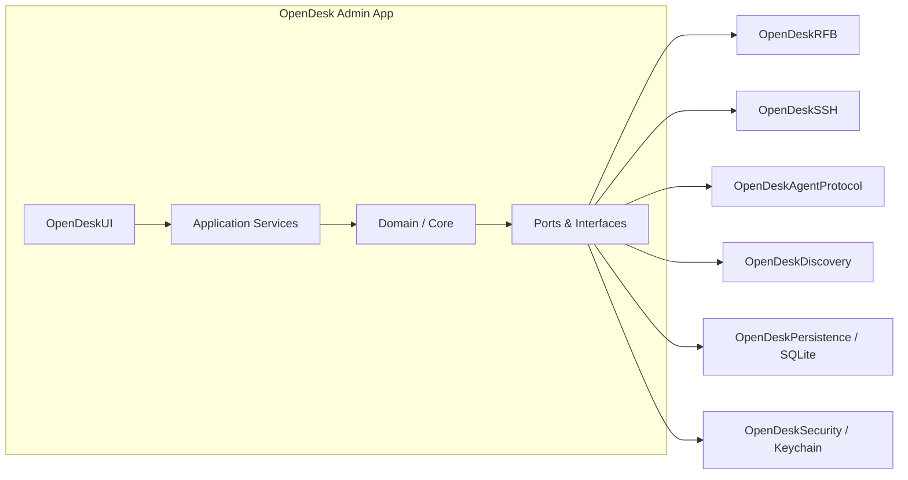
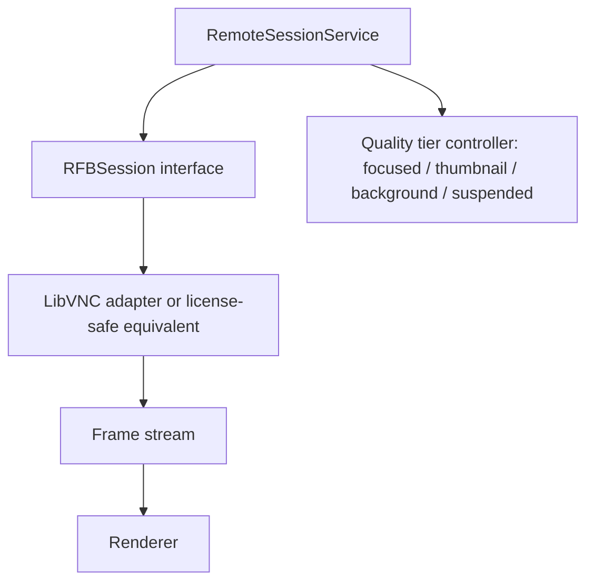

# SYSTEM_ARCHITECTURE — OpenDesk

**Authority:** Decision-precedence level 4 in `AGENTS.md` §2.1. Living document; must be reconciled with code by Plan 19.

---

## 1. Overview

OpenDesk is a native macOS application (SwiftUI primary, AppKit where required) that administers remote Macs through three transports — RFB/VNC, SSH, and the OpenDesk Endpoint Agent — under one governed task engine, with a persistent local registry, inventory, and audit trail.



---

## 2. Module Map

| Module | Responsibility | Notes |
|---|---|---|
| OpenDeskCore | Domain types, identifiers, policies, errors | No transport or storage dependencies |
| OpenDeskPersistence | SQLite, migrations, repositories | Secrets are references only |
| OpenDeskSecurity | Keychain store, host-key policy, authorization, redaction | Interface established in Plan 03, filled in Plan 05 |
| OpenDeskDiscovery | Manual add, mDNS, CIDR scan, probes, reconciliation | Plan 04 |
| OpenDeskRFB | RFB session adapter, framebuffer, input, states | Plan 06; C boundary isolation |
| OpenDeskSSH | SSH transport, commands, SFTP, package pipeline, power | Plan 07 |
| OpenDeskTasks | Task engine, scheduler, retry, idempotency | Plan 08; wraps all operations |
| OpenDeskInventory | Collectors, snapshots, diff, reports, drift | Plan 09 |
| OpenDeskUI | SwiftUI surfaces | Never invokes Process/sockets/SQLite/Keychain directly |
| OpenDeskAgentProtocol | Agent wire protocol + IPC definitions | Plan 11 |
| OpenDeskCLI | CLI target, local socket API, App Intents | Plan 12; shares application services with UI |

---

## 3. Dependency Direction (binding)

```text
UI → Application Services → Domain → Interfaces → Transport/Persistence implementations
```

Enforcement: package graph/lint checks where possible; review rule otherwise. Transport-specific types must not leak into UI state.

---

## 4. Process Model

```text
OpenDesk.app (admin)
  └─ sessions/processes spawned per capability need

Managed Mac:
  ├─ OpenDeskAgent Daemon (LaunchDaemon, root) — inventory, packages, power, durable jobs, status, secure files
  └─ OpenDeskAgent UserAgent (per-user LaunchAgent) — screen capture, notifications, clipboard, session interaction
```

IPC: authenticated XPC with strict allowlist; **no arbitrary privileged shell execution exposed**. Registration via `SMAppService` (macOS 13+).

---

## 5. Session Architecture (remote view)



Session states: `idle, connecting, authenticating, connected, reconnecting, failed, closing, closed`. The central `SessionManager` owns all sessions; views never own raw transports (Plan 10).

---

## 6. Failure Model

Typed errors (from Plan 03):

```text
TransportError
AuthenticationError
AuthorizationError
TaskExecutionError
PersistenceError
ProtocolError
PermissionError
ConfigurationError
```

User-safe descriptions separate from internal diagnostics; redaction enforced at all sinks (Plans 05/18).

---

## 7. Observability

Structured OSLog with categories `app, discovery, rfb, ssh, agent, tasks, scheduler, inventory, database, security, update, release`; correlation IDs on all cross-component operations; diagnostic bundle export (Plan 18).

---

## 8. Release Architecture

Developer ID + Hardened Runtime + notarization + staple + Gatekeeper assessment; Sparkle 2 signed update feed (HTTPS, Ed25519); SBOM + checksums published per release (Plans 20/22).
