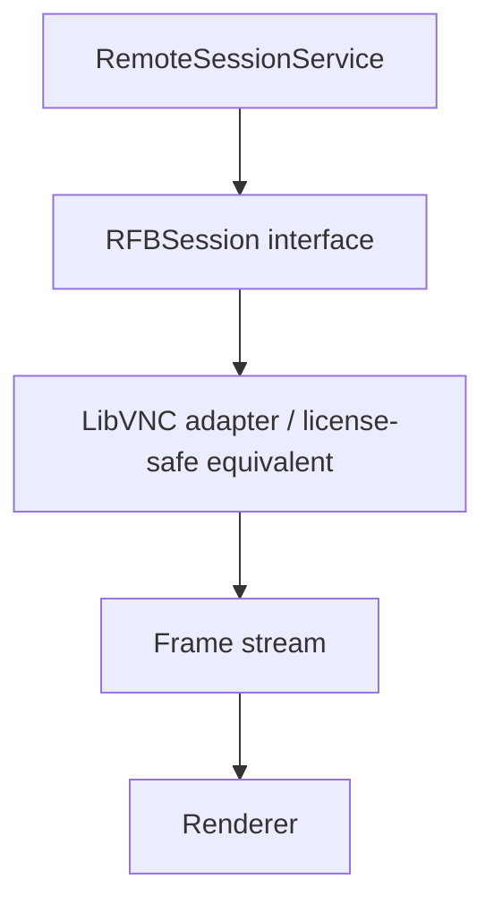

# TRANSPORT_ARCHITECTURE — OpenDesk

**Authority:** Decision-precedence level 4. Governs Plans 06, 07, 10, 11, 14.

---

## 1. Transport Portfolio

| Transport | Purpose | Plan |
|---|---|---|
| RFB/VNC (5900; ARD security type 30) | Observe/control against macOS Remote Management and ordinary VNC servers | 06 |
| SSH (22) | Commands, SFTP file ops, package staging, power | 07 |
| OpenDesk Agent channel (TLS, project-defined port) | No-SSH management: inventory, packages, power, status, secure files | 11 |
| ScreenCaptureKit + VideoToolbox stream | High-performance native remote view (post-parity-core) | 14 |

Capability probing (Plan 04) decides which transports a device supports; probes over guessing.

---

## 2. RFB Session Model

- Explicit state machine: `idle, connecting, authenticating, connected, reconnecting, failed, closing, closed` — never scattered booleans.
- C callbacks isolated behind the Swift adapter boundary.
- Input correctness obligations: modifiers, function keys, international events, mouse buttons, scroll, high-DPI and multi-display coordinates.
- Licensing: LibVNCClient used only if compatible with the project license; conflicts resolved by (a) license-compatible implementation, (b) separately distributed process boundary, plus ADR + legal-release-gate flag if unresolved (Plan 06).

---

## 3. SSH Model

`RemoteCommandService` contract: `command, arguments, environment, working directory, timeout, stdout, stderr, exit code, cancellation`. No unstructured shell concatenation. Host-key validation per `SECURITY_ARCHITECTURE.md` §3. Connection reuse + SFTP for file operations. Package workflow: validate → checksum → stage → remote verify → `installer -pkg ... -target /` → collect status → cleanup → optional reboot.

---

## 4. Session Management (Plan 10)

- Central `SessionManager` owns every transport session; views subscribe.
- Quality tiers: `focused` (up to server/session limit), `visible-thumbnail` (~2–5 FPS), `background` (heavily throttled), `suspended` (near-zero).
- Grids: 2/4/8/16 subject to resource limits; promotion upgrades tier without full reconnect.
- Gate: 16-session synthetic load shows no runaway memory/CPU/threads/connections.

---

## 5. OpenDesk Agent Channel (Plan 11)

- TLS only; standard primitives; mutual identity when practical.
- Handshake: `protocolVersion`, `capabilities[]`, `agentVersion`; ≥1 version skew tolerated.
- IPC inside the endpoint: authenticated XPC with strict allowlist; no arbitrary privileged shell to untrusted local clients.
- Enrollment: local interactive, one-time token, MDM path; per-device identity minted post-enrollment; secrets in Keychain.

---

## 6. High-Performance Streaming (Plan 14, post-parity-core)

- Capture: ScreenCaptureKit (dynamic resolution, multi-display, metadata, interruption handling).
- Encode: VideoToolbox H.264 first; HEVC where justified.
- Transport: secure, congestion-aware; channel split `control / video / audio / input / telemetry`; **no raw UDP without congestion/error-control semantics**.
- Decode/render: VideoToolbox + Metal.
- Adaptive quality inputs: RTT, loss, encoder/decoder pressure, bandwidth, render backlog; outputs: resolution, bitrate, FPS, keyframe behavior.

---

## 7. Cross-Transport Invariants (binding)

1. Every transport honors network timeouts and rate limits (Plan 16 controls).
2. Every transport surfaces typed errors, never bare failures.
3. Every operation is a Task (Plan 08) with correlation ID; no transport side-channels that bypass audit.
4. Host identity rules (§3 of SECURITY_ARCHITECTURE) apply uniformly.
