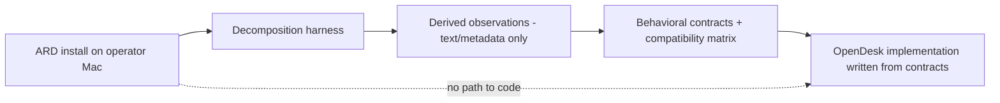

# IMPLEMENTATION_SEPARATION — OpenDesk

**Purpose:** Guarantee that clean-room behavioral observations (Plan 02) never contaminate OpenDesk implementation with proprietary material.

---

## 1. Separation Model



- The harness reads an installed, lawfully obtained ARD app and emits **only** derived text/metadata observations.
- OpenDesk source is written from the behavioral contracts and public documentation — never from Apple binaries, assets, or disassembly.
- No Apple binary, asset, framework blob, or resource file is ever committed to this repository.

---

## 2. Repository Hygiene Rules

1. Harness outputs land under `docs/clean-room/` (or a dedicated data directory) as text: bundle trees, plist summaries, endpoint lists, experiment results.
2. Commits touching clean-room artifacts must not contain Apple-owned content (enforced by review; secret/supply scan catches binary blobs).
3. Third-party interoperability code (e.g., LibVNCClient) is used under its own license terms, recorded in `THIRD_PARTY_NOTICES.md`, with licensing architecture documented if separation-by-process is required (Plan 06).
4. Any accidental inclusion of proprietary content is treated as a P0 finding: purge from tree and history where practical, document in `PROGRAM_STATUS.md`.

---

## 3. Role Boundaries

| Role | May access Apple binaries | May commit to OpenDesk |
|---|---|---|
| Decomposition harness (analysis) | Yes (local only) | Derived observations only |
| Implementation agents | No | Source written from behavioral contracts |
| Review agents | No | Verify contracts ↔ implementation traceability |

---

## 4. Traceability Requirement

Every Plan 02 behavioral contract links to:

```text
experiment ID → observations → compatibility matrix row → implementing plan/task
```

Reviews check the chain exists; a missing chain is a spec-compliance finding.
