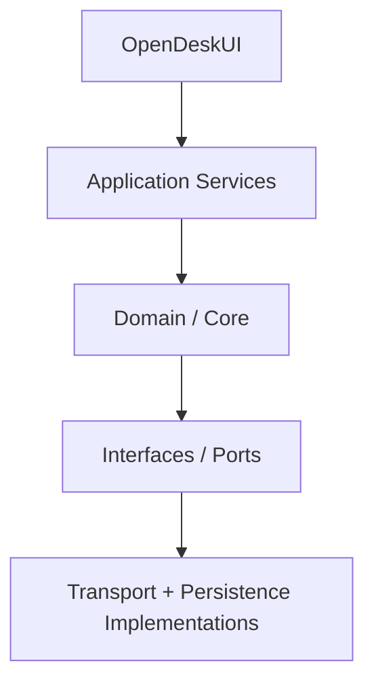

# Plan 03 — Architecture Foundation

> Binding instruction document. Read `/AGENTS.md`, `docs/architecture/SYSTEM_ARCHITECTURE.md`, `docs/architecture/DATA_MODEL.md`, and `docs/architecture/TASK_MODEL.md` first.
> Execute in an isolated worktree/branch per `AGENTS.md` §4.

- **Plan ID:** 03
- **Prerequisites:** 01, 02
- **Blocks:** 04–12

---

## 1. Goal

Create stable internal boundaries before feature proliferation.

---

## 2. Required Module Boundaries

Adapt names to existing project conventions, but maintain these responsibilities:

```text
OpenDeskCore
OpenDeskPersistence
OpenDeskSecurity
OpenDeskDiscovery
OpenDeskRFB
OpenDeskSSH
OpenDeskTasks
OpenDeskInventory
OpenDeskUI
OpenDeskAgentProtocol
OpenDeskCLI
```

---

## 3. Core Domain Types

Define stable identifiers:

```text
DeviceID
GroupID
TaskID
SessionID
CredentialID
InventorySnapshotID
```

Define domain objects for:

```text
Device
Endpoint
Capability
CredentialReference
Task
TaskTarget
TaskEvent
Group
SmartGroup
RemoteSession
InventorySnapshot
AuditEvent
```

**No transport-specific object leaks into UI state.**

---

## 4. Data Model

Versioned SQLite migrations from migration `001`. Core tables:

```text
devices
device_endpoints
device_capabilities
credentials
groups
group_memberships
smart_groups
tasks
task_targets
task_events
task_templates
schedules
sessions
inventory_snapshots
audit_events
agent_status
```

Passwords and private keys are references only (see `docs/architecture/DATA_MODEL.md` and `docs/architecture/SECURITY_ARCHITECTURE.md`).

---

## 5. Dependency Direction



UI must not invoke `Process`, sockets, SQLite, or Keychain directly.

---

## 6. Failure Model

Create typed errors:

```text
TransportError
AuthenticationError
AuthorizationError
TaskExecutionError
PersistenceError
ProtocolError
PermissionError
ConfigurationError
```

Provide user-safe descriptions separately from internal diagnostics (feeds Plan 18 redaction rules).

---

## 7. Agent Sequence

1. Create module skeleton with dependency direction enforced (lint rule or package graph check where possible).
2. Implement domain types and typed errors with tests.
3. Implement SQLite layer: migration runner from `001`, schema of §4, repository interfaces.
4. Implement Keychain wrapper seam in OpenDeskSecurity (implementation details land in Plan 05; establish the interface now).
5. Build the minimal application shell (SwiftUI) that renders navigation but no features.
6. Wire: launch → open DB → migrate → create Device → create Task → persist AuditEvent → render shell.

---

## 8. Tests Required

- Domain type round-trip persistence tests.
- Migration test suite (empty DB → latest; each intermediate version).
- Error-type unit tests.
- Shell launch smoke test (automated where feasible; otherwise scripted manual evidence).

---

## 9. Exit Gate

A minimal app can:

```text
launch
open database
migrate database
create/load a Device
create a Task
persist an AuditEvent
render the basic application shell
```

with automated tests.

---

## 10. Status Update

On completion update `docs/status/PROGRAM_STATUS.md` and `program-state.json` (next: `04-DEVICE-DISCOVERY-REGISTRY`).
