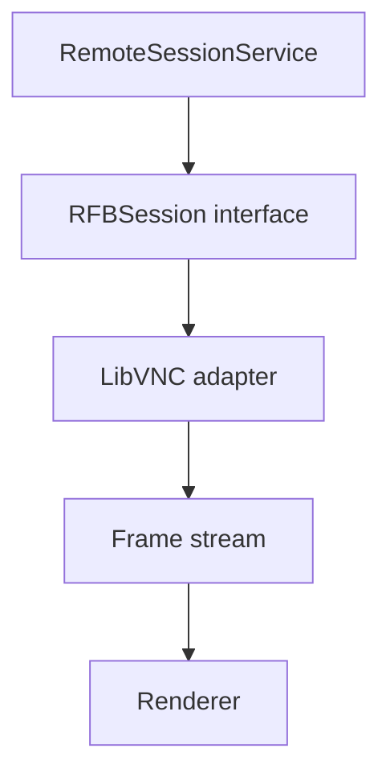

# Plan 06 — RFB / Remote Control

> Binding instruction document. Read `/AGENTS.md`, `docs/architecture/TRANSPORT_ARCHITECTURE.md`, and `docs/clean-room/PROTOCOL_OBSERVATIONS.md` first.
> Execute in an isolated worktree/branch per `AGENTS.md` §4.

- **Plan ID:** 06
- **Prerequisites:** 03, 04, 05
- **Blocks:** 07–10 (transport foundation)

---

## 1. Goal

Achieve usable remote Observe and Control against macOS Remote Management.

---

## 2. Phase 1 Transport

Use LibVNCClient if licensing remains compatible with the project's established open-source license.

If direct linkage introduces a license conflict:

1. do not violate either license;
2. evaluate a license-compatible implementation;
3. otherwise place the GPL component behind a separately distributed process boundary;
4. record the licensing architecture (ADR required);
5. flag legal review as a release gate in `docs/status/PROGRAM_STATUS.md` if uncertainty remains.

---

## 3. Required Session Capabilities

```text
connect
disconnect
authentication
framebuffer rendering
mouse input
keyboard input
clipboard
observe-only
control mode
display resizing
full-screen
scaling
reconnect
connection diagnostics
```

---

## 4. Architecture



C callbacks must not leak through the Swift application layer. Connection states are explicit:

```text
idle
connecting
authenticating
connected
reconnecting
failed
closing
closed
```

Never represent connection state as scattered booleans.

---

## 5. Input Correctness

Verify:

```text
modifier keys
function keys
international keyboard events
mouse buttons
scroll
high-DPI coordinates
multi-display coordinates
```

---

## 6. Tests Required

```text
protocol adapter unit tests
fake RFB server integration tests
authentication failure tests
framebuffer decoding fixtures
reconnect tests
clipboard tests
100-cycle connect/disconnect soak
```

Use a real Mac integration lane whenever hardware is available.

---

## 7. Exit Gate

A supported Mac with Remote Management enabled can be observed and controlled reliably without Apple Remote Desktop.

---

## 8. Status Update

On completion update `docs/status/PROGRAM_STATUS.md` and `program-state.json` (next: `07-SSH-FILES-PACKAGES-POWER`).

---

## Amendment A1 — Three-Conversation Addendum (2026-09-13, Addendum §9)

The conversation-derived implementation (Raw framebuffer decoding, Hextile, CGImage/NSImage renderer, ScreenStreamer, keyboard, pointer, scroll, clipboard/CutText, tiled observation) is verified on the canonical branch — retain and verify all of it (see `docs/status/CAPABILITY_AUDIT.md`). The following production-hardening requirements were NOT demonstrated in any conversation and are mandatory for Plan 06 exit:

```text
connection cancellation (prompt, resource-freeing)
bounded reconnect (attempt cap, backoff, jitter)
multi-display behavior (display enumeration, per-display observe)
resolution changes (live display reconfiguration)
pixel-format changes (server-initiated format negotiation)
international keyboards (keysym correctness beyond US layout)
modifier-key correctness (CapsLock, Fn, right-hand modifiers)
clipboard limits (size caps, sanitization)
malformed server input (fuzzed decoder paths, no crash/OOM)
oversized framebuffer defense (dimension caps before allocation)
encoding negotiation fallback (hextile → copyrect → raw ladder)
resource cleanup (sockets, buffers, timers on every exit path)
100-cycle connection soak (already §6 — verify bounded memory)
```

Also enforce the conversation-derived regression invariants (Addendum §1, mapped in `docs/status/CAPABILITY_AUDIT.md` §Required tests): RFB `003.889` safe parse, DES known-answer vector, `FramebufferUpdateRequest` 10-byte wire format with both X and Y, partial-socket-read handling, loopback integration server (handshake, no-auth, VNC auth, wrong-password rejection, framebuffer, keyboard, pointer, clipboard).
