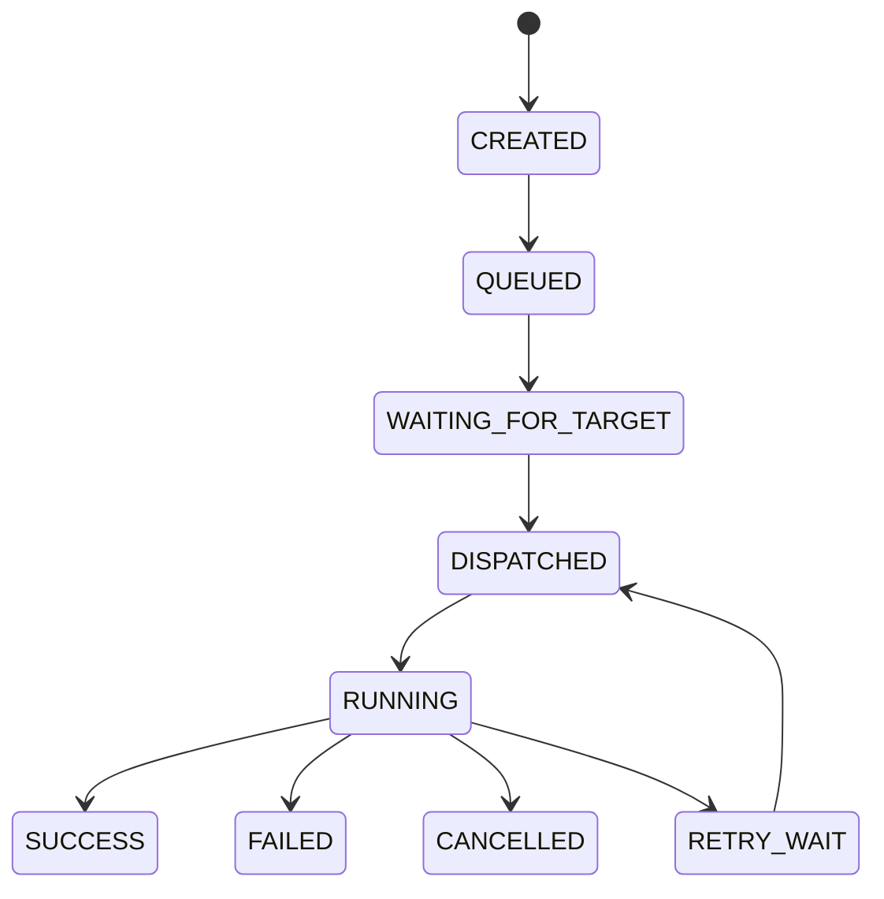

# Plan 08 — Unified Task Engine, Scheduler and Worker

> Binding instruction document. Read `/AGENTS.md` and `docs/architecture/TASK_MODEL.md` first.
> Execute in an isolated worktree/branch per `AGENTS.md` §4.

- **Plan ID:** 08
- **Prerequisites:** 03–07
- **Blocks:** 09–13, 15 (composer), 21 (durable suite)

---

## 1. Goal

Make all administrative operations durable, observable tasks.

---

## 2. Canonical State Machine



Terminal states are immutable.

---

## 3. Task Object

Every task contains:

```text
TaskID
type
target selector
resolved targets
parameters
execution policy
schedule
created at
deadline
state
results
retry policy
idempotency key
correlation ID
```

---

## 4. Target Resolution

Support:

```text
device IDs
static group
smart group
predicate
```

Snapshot resolved targets at dispatch unless task semantics explicitly require dynamic resolution.

---

## 5. Scheduler

Support:

```text
run now
run once
RRULE recurrence
run when device returns online
run when predicate becomes true
```

---

## 6. Retry

Classify failures:

```text
retryable transport
retryable offline
authentication — normally not retryable
authorization — not retryable
invalid request — not retryable
remote execution failure — configurable
```

Use capped exponential backoff with jitter.

---

## 7. Idempotency

Installation, copy, inventory, and agent operations must define their idempotency semantics (idempotency key + per-type reentry rules).

---

## 8. Concurrency Controls

Global + per-host limits. Protect against accidentally executing hundreds of expensive operations simultaneously.

---

## 9. Agent Sequence

1. Implement task persistence (tables from Plan 03), state machine with guarded transitions.
2. Implement worker pool with global/per-host concurrency limits.
3. Implement target resolution + snapshot-at-dispatch.
4. Implement retry classification + backoff policy.
5. Implement scheduler modes (now/once/RRULE/online/predicate).
6. Wire Plan 06/07 operation types into task types with idempotency semantics.
7. Implement cancellation (cooperative cancellation at every adapter).

---

## 10. Tests Required

- State machine transition table tests (every legal/illegal transition).
- Scheduler tests (clock-injected for recurrence/offline/predicate).
- Retry/backoff tests (deterministic jitter seed).
- Cancellation tests mid-run.
- Restart-durability tests: task survives app kill at every state.
- Concurrency-limit tests under synthetic load.

---

## 11. Exit Gate

Closing and reopening OpenDesk cannot lose scheduled or running task history.

---

## 12. Status Update

On completion update `docs/status/PROGRAM_STATUS.md` and `program-state.json` (next: `09-INVENTORY-REPORTING`).
