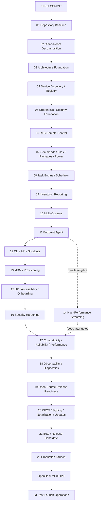

# PROGRAM_CHARTER — OpenDesk First-Commit-to-v1.0 Delivery Program

> Program-wide policy. Binding on every coding agent alongside `AGENTS.md`.
> Per-plan instructions live in `docs/program/00`–`23`. This charter defines the rules that govern all of them.

---

## 1. Mission Statement

Take OpenDesk from its present first-commit development state through a signed, notarized, publicly downloadable, operational v1.0 release with no routine human supervision.

**Primary product objective:** Deliver an open-source, API-first, agent-ready macOS fleet administration application that covers the practical administrative outcomes of Apple Remote Desktop while using independent implementation, public protocols, public documentation, and clean-room behavioral analysis.

**Execution principle:** Agents make decisions. They do not turn ordinary ambiguity into user questions.

---

## 2. Critical Path / Milestone Order

The controlling agent follows exactly this critical path:



Plan 14 may execute in parallel after Plan 11 if sufficient agent capacity exists. It must not delay core v1 functional completion unless High-Performance Streaming is explicitly promoted into the v1 release gate by ADR.

---

## 3. Product-Wide Definition of Done

OpenDesk v1.0 is complete only when all requirements below hold simultaneously. A missing `PASS` anywhere blocks the final completion condition (§8).

### 3.1 Fleet basics

```text
PASS — discover Macs
PASS — manually add host
PASS — persistent registry
PASS — static groups
PASS — smart/dynamic groups
PASS — connectivity/capability status
```

### 3.2 Remote assistance

```text
PASS — observe
PASS — control
PASS — keyboard/mouse
PASS — clipboard
PASS — display scaling
PASS — reconnect
PASS — multi-observe
```

### 3.3 Administration

```text
PASS — command execution
PASS — script execution
PASS — push files
PASS — pull files
PASS — package installation
PASS — wake
PASS — restart
PASS — shutdown
PASS — logout where supported
```

### 3.4 Tasks

```text
PASS — one machine
PASS — groups
PASS — durable history
PASS — per-target results
PASS — cancellation
PASS — retry
PASS — schedule
PASS — offline/reconnect execution
PASS — templates
```

### 3.5 Inventory

```text
PASS — hardware
PASS — OS
PASS — storage
PASS — network
PASS — applications
PASS — users
PASS — management status
PASS — export
PASS — historical snapshots
```

### 3.6 Agent

```text
PASS — secure enrollment
PASS — version negotiation
PASS — daemon lifecycle
PASS — user agent lifecycle
PASS — agent update path
PASS — management without SSH
```

### 3.7 Automation

```text
PASS — CLI
PASS — JSON
PASS — local API
PASS — Apple App Intents / Shortcuts
```

### 3.8 Security

```text
PASS — secrets in Keychain
PASS — no plaintext credential persistence
PASS — host/server identity verification
PASS — audit trail
PASS — secure updater
PASS — hardened release
PASS — dependency/license inventory
PASS — SBOM
PASS — no open Critical/High finding
```

### 3.9 Reliability

```text
PASS — restart persistence
PASS — reconnect
PASS — offline targets
PASS — partial failure
PASS — cancellation
PASS — timeout handling
PASS — long-running soak
PASS — no material resource leak
```

### 3.10 Distribution

```text
PASS — Developer ID signed
PASS — Hardened Runtime
PASS — notarized
PASS — stapled
PASS — Gatekeeper assessed
PASS — public download
PASS — signed update feed
PASS — reproducible release procedure
```

### 3.11 Open source

```text
PASS — source public
PASS — license
PASS — dependency notices
PASS — README
PASS — build docs
PASS — contributing guide
PASS — security policy
PASS — architecture docs
```

### 3.12 Launch

```text
PASS — v1.0.0 public tag
PASS — public binary
PASS — published checksums
PASS — published SBOM
PASS — install smoke
PASS — core remote-control smoke
PASS — task smoke
PASS — updater smoke
PASS — rollback runbook
```

---

## 4. Autonomous Phase-Gate Protocol

At the conclusion of every plan, the controlling agent must generate and append to `docs/status/PROGRAM_STATUS.md` (section 4):

```text
PLAN:
COMMIT RANGE:
BUILD:
TESTS:
SECURITY:
REVIEW:
DEFECTS:
EXTERNAL GATES:
DOCUMENTATION:
EXIT CRITERIA:
RESULT: PASS / FAIL
NEXT PLAN:
```

A `FAIL` means:

```text
repair → rerun relevant checks → rereview
```

not "ask the user what to do." Only `PASS` advances the program.

---

## 5. Agent Handoff Contract

Every new coding-agent session receives exactly this mission:

> Read `/AGENTS.md`, `docs/product/PRODUCT_SPEC.md`, `docs/product/V1_SCOPE.md`, `docs/status/program-state.json`, and the currently active plan in `docs/program/`. Inspect the repository before changing code. Resume from the first incomplete verified task; never repeat completed work solely because conversational context is missing. Make technical decisions autonomously according to the decision precedence in `AGENTS.md`. Implement the complete active plan, including tests, documentation, integration, review remediation, and status updates. Do not stop after writing code. Do not ask the user ordinary implementation questions. Only unresolved external credential, interactive authorization, destructive-operation, or legally non-resolvable gates may remain, and they must be isolated after every repository-side prerequisite has been completed.

---

## 6. Scope Discipline

The coding agents must prevent OpenDesk from becoming an endless platform project before v1.

The v1 critical path is:

```text
Discover → Connect → Control → Administer → Group → Schedule → Inventory → Automate → Secure → Ship
```

The following are **not allowed to hold v1 hostage** unless necessary for a required capability:

```text
pixel matching Apple Remote Desktop
duplicating Apple's private Task Server wire protocol
duplicating every ARD report
supporting every historical macOS release
custom cloud infrastructure
accounts/billing
mobile apps
Windows administrator app
Linux administrator app
browser administrator app
plugin marketplace
AI remediation
full GitOps
Docker management
Homebrew fleet orchestration
advanced compliance engine
```

Record these as post-v1 opportunities. A scope addition requires an ADR with a justification tied to a v1 capability.

---

## 7. External Gates That Agents Cannot Legitimately Eliminate

The zero-human policy applies to **software-engineering decisions**, not to bypassing platform security.

These may still require an authorized person or configured account:

```text
Apple Developer Program membership
Developer ID certificate issuance
App Store Connect/API credentials
MFA
acceptance of Apple agreements
macOS Screen Recording consent
macOS Accessibility consent
background-item authorization
MDM enrollment authority
domain/DNS ownership
GitHub organization permissions
```

Agents must never circumvent these controls. The correct autonomous response is:

```text
detect → document → automate everything around the gate → continue unrelated work → make the remaining gate one atomic action
```

Record the gate in `docs/status/PROGRAM_STATUS.md` under External Gates.

---

## 8. Final Program Completion Condition

The project is complete only when:

```text
code complete
AND CI green
AND security gate green
AND compatibility gate green
AND release artifact signed
AND release artifact notarized
AND release artifact publicly downloadable
AND public source tagged v1.0.0
AND stable update feed live
AND clean-machine installation passes
AND remote-control smoke passes
AND administration-task smoke passes
AND rollback path proven
```

At that point `docs/status/program-state.json` becomes:

```json
{
  "product": "OpenDesk",
  "release": "1.0.0",
  "programStatus": "COMPLETE",
  "productionStatus": "LIVE",
  "blockingDefects": [],
  "externalGates": [],
  "nextProgram": "post-launch"
}
```

That is the Definition of Done for the first-commit-to-production OpenDesk program.
