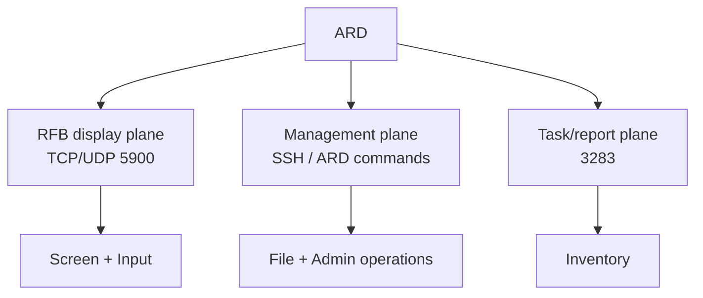

# Protocol Specification

Scope: network protocols OpenDesk Admin speaks or observes. Split into **functional compatibility** (same administrative job — target ~90–95%) and **wire compatibility** (byte-identical protocol — implement only where valuable).

## 1. Port Map (publicly documented)

| Port | Protocol | Function | OpenDesk use |
|---|---|---|---|
| 5900/TCP | RFB/VNC | Observe/control | Primary remote-control channel |
| 5900/UDP | Remote display | Screen traffic | High-performance mode (later) |
| 5901–5902/UDP | High Performance | 30/60 fps, stereo audio, HDR | Observe only; not required for v1 |
| 3283/TCP | ARD reporting | Reporting | Observe for interop; not required for v1 |
| 3283/UDP | ARD data | Additional data | Observe for interop; not required for v1 |
| 22/TCP | SSH | Encrypted transfers/control | **Management backbone** |

## 2. Protocol Decomposition

ARD is not one protocol — it is three independent planes:



## 3. RFB/VNC (RFC 6143)

- Baseline: standard RFB per RFC 6143 — handshake, security negotiation, framebuffer update request, pixel format, encodings.
- **Apple ARD authentication = security type 30.** LibVNCClient documents support for it, giving immediate interoperability with macOS Remote Management without rediscovering the handshake from packets.
- Also support: standard VNC auth, TLS, VeNCrypt → Linux/Windows/Unix VNC hosts work out of the box.
- Features: framebuffer, mouse/keyboard input, clipboard, display selection, scaling, full screen, observe-only vs control, reconnection, adaptive quality.

### Licensing note

LibVNCServer/LibVNCClient is GPL-2.0-or-later. Linking it makes the distributed program GPL-compliant. Project license: **GPL-3.0-or-later** (whole project). Alternative (permissive UI + GPL RFB process + local IPC) is rejected as unnecessary complexity at this stage.

## 4. SSH Management Plane

All non-screen administration rides SSH in v1:

```
OpenDesk ──SSH──► commands / scripts / SFTP / installer
```

- Command + multi-line script execution with exit codes, stdout/stderr capture, timeouts.
- SFTP: push/pull, recursive, overwrite/rename-on-conflict, preserve timestamps+permissions, resume, checksums, progress, bandwidth limits, parallel transfers.
- Package install pipeline:

```
.pkg → checksum → SFTP stage → sudo installer -pkg PKG -target /
→ capture exit/output → delete staging artifact → optional reboot
```

## 5. Discovery

| Mechanism | Output |
|---|---|
| Bonjour/mDNS | hostname, Bonjour name, ARD/RFB availability |
| CIDR/IP scan | IP, MAC (when available), SSH/RFB port state, latency |
| Manual | hostname/IP entry |

Scanner record: `hostname, ips, mac, rfb_available, ssh_available, latency, os_version, ard_client_version, auth_state, last_seen`.

## 6. Wire Compatibility Decisions

| Item | Decision | Reason |
|---|---|---|
| ARD auth (type 30) via LibVNCClient | **Implement** | Immediate macOS Remote Management interop |
| RFB screen control | **Implement** | Core feature, standard protocol |
| 3283 reporting | **Observe only** | Potentially valuable; not a v1 blocker |
| Proprietary Task Server internals | **Skip** | Replaced by our own durable queue |
| Apple High Performance stream | **Skip initially** | Build own ScreenCaptureKit/VideoToolbox/QUIC stack later |

## 7. High-Performance Streaming (OpenDesk-native, V2+)

```
ScreenCaptureKit → VideoToolbox H.264/HEVC → QUIC/UDP → decode → Metal
```

Separate streams: video, audio, pointer, keyboard, clipboard, control, telemetry. Targets 30/60 FPS, 4K, adaptive bitrate, HDR, multi-display, hardware encode/decode. This reaches the same *outcome* as Apple's High Performance mode without Apple's internal implementation.

## 8. Dynamic Observation Protocol (analysis lab)

Isolated two-Mac test network (Admin Mac + Client Mac). Per experiment capture: network (`tcpdump -i en0 '(port 22 or port 3283 or port 5900 or port 5901 or port 5902)'`), filesystem (`fs_usage`), Unified Log (`log stream` / `log show`), process tree, launchd activity, SQLite mutations, preferences, task lifecycle, failure states, permission prompts, reconnect behavior. **No encryption bypass.** See `scripts/` and `reverse-engineering/behavior-specs/`.
