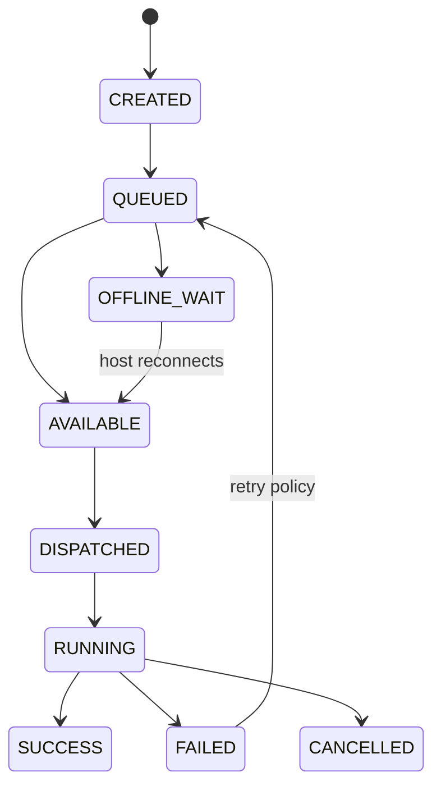

# Task Lifecycle — State Machine (Clean-Room Spec)

Every OpenDesk management operation is a Task:

```
Target Set + Action + Parameters + Execution Strategy + Schedule + Result
```



## States

| State | Meaning |
|---|---|
| `created` | Task object persisted, not yet queued |
| `queued` | Accepted by task engine |
| `available` | Targets reachable; ready to dispatch |
| `offline_wait` | One or more targets offline; waiting per `execution.mode` |
| `dispatched` | Sent to transport (SSH/RFB/agent) |
| `running` | Executing on target(s) |
| `success` | All targets succeeded |
| `failed` | One or more targets failed (per-target results in `task_targets`) |
| `cancelled` | Cancelled by operator |

## Execution modes

- `immediate` — dispatch now; offline targets fail fast unless retry policy says otherwise
- `on_reconnect` — park in `offline_wait`; execute when host heartbeat returns
- `on_predicate` — park until smart-group predicate becomes true

## Retry policy (JSON)

```json
{ "max_attempts": 3, "backoff": "exponential", "base_seconds": 30, "retry_on": ["timeout", "connection"] }
```

## Invariants

1. Every state transition writes a `task_events` row.
2. Per-target results are independent — one target's failure never blocks others.
3. `idempotency_key` prevents duplicate execution across worker restarts.
4. Terminal states are immutable; retries create a new attempt linked by `idempotency_key`.
5. All admin-initiated tasks write an `audit_events` row.
